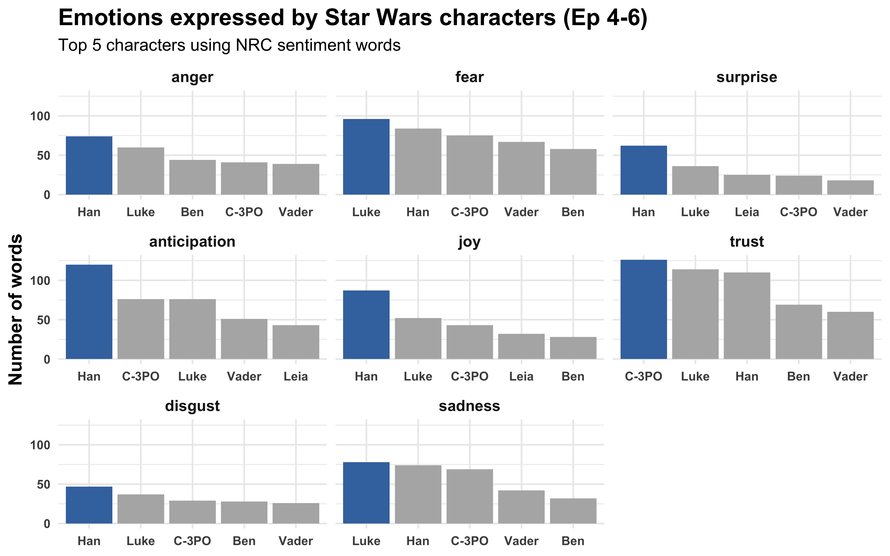
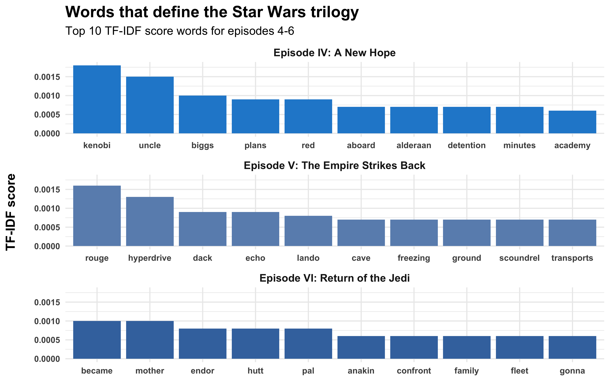
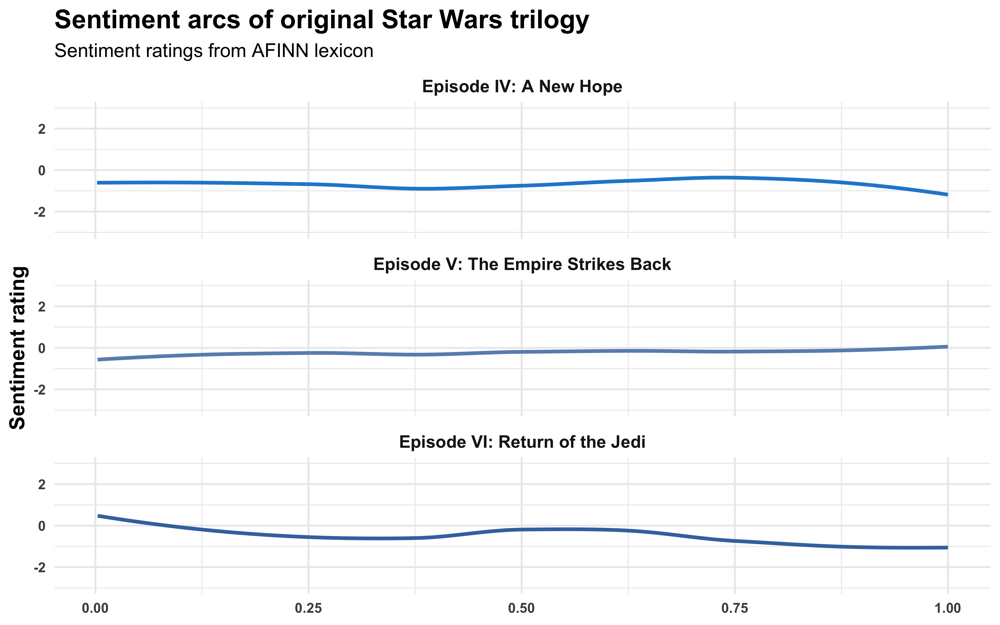

# Text analysis of Star Wars movie scripts

The data was obtained from [Kaggle](https://www.kaggle.com/xvivancos/star-wars-movie-scripts?select=SW_EpisodeVI.txt).

Playing around with text mining related libraries in both [Python](jupyter_notebooks/) and [R](rmarkdown/) using Star Wars movie script data.

Below are some plots created in R:

